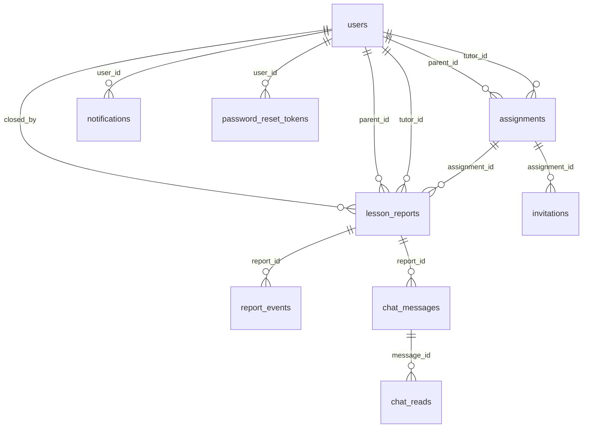

# Data Model

## ER 図

## ReportStatus 列挙値

| 値 | 日本語名 | 終端 |
|----|---------|:----:|
| `draft` | 下書き | |
| `awaiting_parent_approval` | 保護者承認待ち | |
| `parent_approved` | 保護者承認済み | |
| `submitted_to_admin` | 運営提出済み | |
| `received` | 受付済み | |
| `re_reviewed` | 再鑑済み | |
| `admin_approved` | 最終承認済み | ✓ |
| `returned_to_tutor` | 講師へ差戻し | |
| `returned_to_receiver` | 受付へ差戻し | |
| `closed` | クローズ | ✓ |

Enum は Python 側（`app/models/entities.py`）で定義し、DB には `VARCHAR(32)` として保存する。

## 主要テーブル

### lesson_reports（報告書）

| カラム | 型 | 制約 | 説明 |
|--------|------|------|------|
| id | UUID | PK | 報告書ID |
| assignment_id | UUID | FK(assignments.id), INDEX | 担当紐付けID |
| tutor_id | UUID | FK(users.id), INDEX | 講師ID |
| parent_id | UUID | FK(users.id), INDEX, NULL | 保護者ID |
| lesson_date | DATE | NOT NULL | 指導日 |
| start_time | TIME | NOT NULL | 開始時刻 |
| end_time | TIME | NOT NULL | 終了時刻 |
| break_minutes | INTEGER | NOT NULL, default=0 | 休憩時間（分） |
| subject | VARCHAR(100) | NULL | 科目 |
| content | TEXT | NOT NULL | 指導内容 |
| status | VARCHAR(32) | INDEX, NOT NULL | ReportStatus 値 |
| target_month | VARCHAR(7) | INDEX, NOT NULL | 対象月（YYYY-MM） |
| submitted_to_parent_at | TIMESTAMP WITH TZ | NULL | 保護者送信日時 |
| parent_approved_at | TIMESTAMP WITH TZ | NULL | 保護者承認日時 |
| submitted_to_admin_at | TIMESTAMP WITH TZ | NULL | 運営提出日時 |
| received_at | TIMESTAMP WITH TZ | NULL | 受付日時 |
| re_reviewed_at | TIMESTAMP WITH TZ | NULL | 再鑑日時 |
| admin_approved_at | TIMESTAMP WITH TZ | NULL | 最終承認日時 |
| stale_since | TIMESTAMP WITH TZ | NULL | 未処理判定日時（初回検出時刻。以降は上書きしない） |
| closed_at | TIMESTAMP WITH TZ | NULL | クローズ日時 |
| closed_by | UUID | FK(users.id), INDEX, NULL | クローズ実行者ID |
| close_reason | VARCHAR(500) | NULL | クローズ理由（クローズ時は必須） |
| created_at | TIMESTAMP WITH TZ | NOT NULL | 作成日時 |
| updated_at | TIMESTAMP WITH TZ | NOT NULL | 更新日時 |

### users

主要テーブルは `users`, `assignments`, `lesson_reports`, `report_events`, `chat_messages`, `chat_reads`, `notifications` です。詳細スキーマは `SPECIFICATION.md §7` を参照してください。
