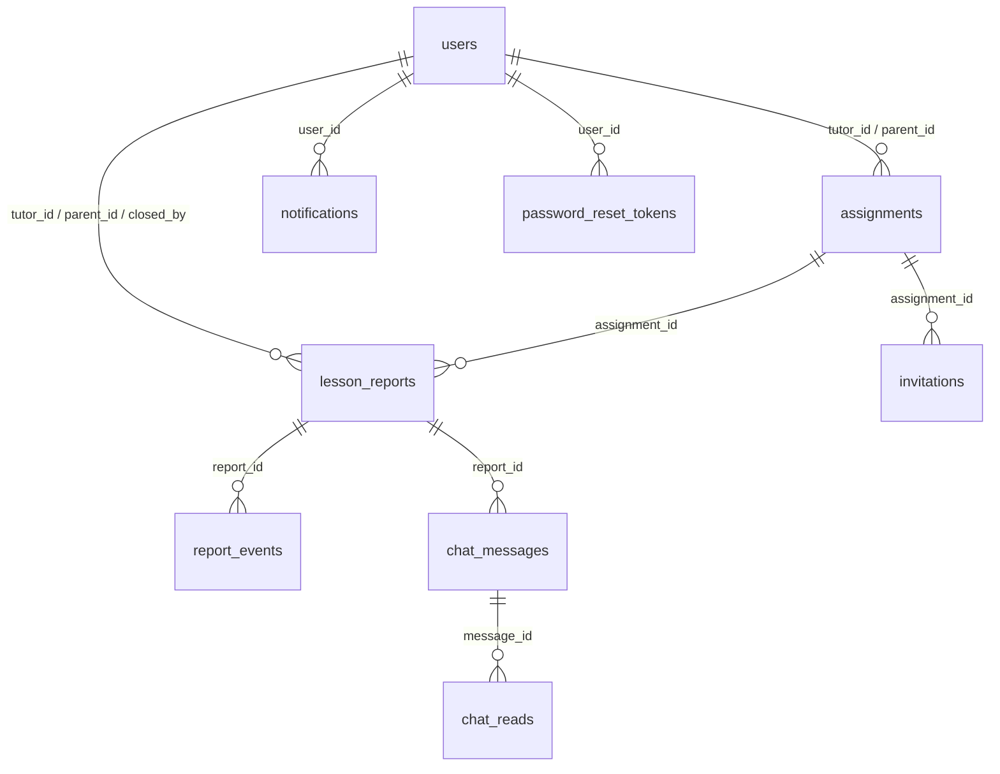
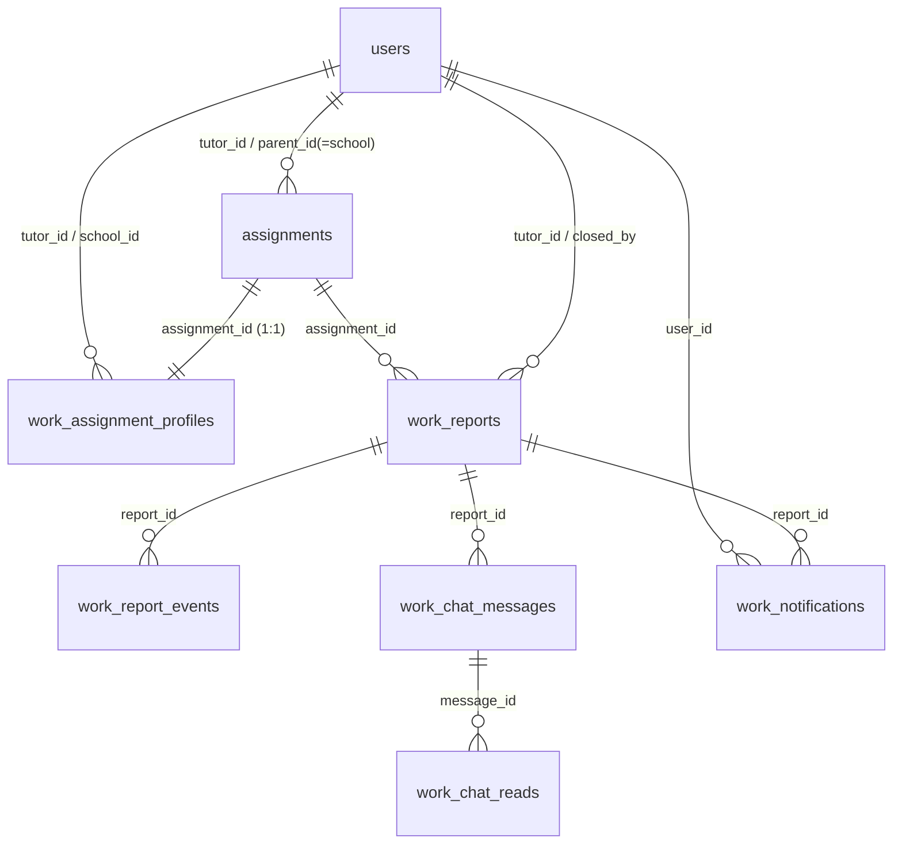

# データモデル（DATA MODEL）— 共通スキーマ正本

> 本書は2システム（イスト勤怠レポート for 代々木進学会 / for EMPS）のDBスキーマ正本。各システムの仕様は `イスト勤怠レポート for 代々木進学会/SPECIFICATION.md`・`イスト勤怠レポート for EMPS/SPECIFICATION.md`、索引は `README.md`。
> 最終更新: 2026-06-22

本書は、本リポジトリで稼働する **2つのシステム** のデータモデルを記載する。

| システム | 用途 | ポート | バックエンド | Alembic バージョン管理 |
|----------|------|:------:|--------------|------------------------|
| **イスト勤怠レポート for 代々木進学会**（旧称: 指導実績報告システム、legacy） | 家庭教師 指導実績報告（tutor→parent→admin の承認フロー） | 8000 | `backend/` | `alembic_version` |
| **イスト勤怠レポート for EMPS**（旧称: 業務連絡表システム、new / work） | 業務連絡表（tutor→school→office→sales の承認フロー） | 8001 | `new_backend/` | `work_alembic_version` |

両システムは **同一の PostgreSQL データベース（`tutor`）** を共有する。`users` / `assignments` / `invitations` / `password_reset_tokens` テーブルは両システムが読み書きする共有テーブルで、**スキーマ（テーブル定義）は「イスト勤怠レポート for 代々木進学会」（legacy）の Alembic が管理する**。「イスト勤怠レポート for EMPS」（new / work）は `work_` プレフィックスの専用テーブル群を追加で持ち、これらは新システムの Alembic（`new_backend/migrations/`）が管理する。

以降、簡潔さのため両システムをそれぞれ「legacy（イスト勤怠レポート for 代々木進学会）」「new / work（イスト勤怠レポート for EMPS）」と表記する。

---

## 1. 共有テーブル（両システム）

`users` / `assignments` / `invitations` / `password_reset_tokens` は両システムで共有する。新システム導入にあたり、いくつかのカラムが追加されている（下表の「追加元」列を参照）。

### users

| カラム | 型 | 制約 | 説明 | 追加元 |
|--------|------|------|------|:------:|
| id | UUID | PK, default=uuid4 | ユーザーID | legacy |
| email | VARCHAR(255) | UNIQUE, INDEX, NOT NULL | メールアドレス（ログインID） | legacy |
| password_hash | VARCHAR(255) | NOT NULL | bcrypt ハッシュ | legacy |
| role | VARCHAR(32) | INDEX, NOT NULL | 主ロール（後述のロール一覧） | legacy |
| roles | JSON | NULL | 複数ロール保有時のロール配列 | legacy |
| display_name | VARCHAR(100) | NOT NULL | 表示名（氏名／学校名） | legacy |
| tutor_no | VARCHAR(20) | NULL | 講師番号（旧システムの採番） | legacy |
| phone | VARCHAR(20) | NULL | 電話番号 | legacy |
| is_active | BOOLEAN | NOT NULL, default=True | 有効フラグ | legacy |
| skip_parent_approval | BOOLEAN | NOT NULL, default=False | 承認スキップ（保護者ユーザー=保護者承認スキップ／学校ユーザー=学校承認スキップ）。ユーザー管理画面で設定 | legacy(0013) |
| must_change_password | BOOLEAN | NOT NULL, default=False | 初回ログイン時にパスワード変更を必須化するフラグ（CSV一括作成ユーザー等の初期パスワード対策）。主に new / work 側で使用 | legacy(0015) |
| deleted_at | TIMESTAMP WITH TZ | NULL | 論理削除日時（ソフトデリート） | legacy |
| user_no | VARCHAR(20) | NULL | 新システムのユーザー番号（T/S/X 番号帯） | **new** |
| allowed_systems | JSON | NULL | アクセス可能システムの配列 | **new** |
| created_at | TIMESTAMP WITH TZ | NOT NULL | 作成日時 | legacy |
| updated_at | TIMESTAMP WITH TZ | NOT NULL | 更新日時 | legacy |

> ロールは旧システム・新システムで値域が異なる。同一ユーザーが両システムにまたがって複数ロールを持つ場合は `roles` 配列で表現する。詳細は「§4 ロール一覧」を参照。

### assignments（担当紐付け）

旧システムでは「講師×保護者×生徒」、新システムでは「講師×学校」の紐付けとして用いる（新システムでは `parent_id` に学校ユーザーを格納し、`student_name` には学校名を入れる運用）。

| カラム | 型 | 制約 | 説明 | 追加元 |
|--------|------|------|------|:------:|
| id | UUID | PK, default=uuid4 | 紐付けID | legacy |
| tutor_id | UUID | FK(users.id), INDEX, NOT NULL | 講師ID | legacy |
| parent_id | UUID | FK(users.id), INDEX, NULL | 保護者ID（新: 学校ID） | legacy |
| student_name | VARCHAR(100) | NOT NULL | 生徒名（新: 学校名） | legacy |
| is_active | BOOLEAN | NOT NULL, default=True | 有効フラグ | legacy |
| skip_parent_approval | BOOLEAN | NOT NULL, default=False | （旧）承認スキップ。**現在は未使用**（判定は `users.skip_parent_approval` に移設） | legacy |
| reminder_enabled | BOOLEAN | NOT NULL, default=False | リマインダー有効 | legacy |
| reminder_days_after | INTEGER | NOT NULL, default=1 | リマインダー間隔（日） | legacy |
| reminder_count | INTEGER | NOT NULL, default=1 | リマインダー最大回数 | legacy |
| created_at | TIMESTAMP WITH TZ | NOT NULL | 作成日時 | legacy |
| system_type | VARCHAR(10) | NULL, default='legacy' | 所属システム（'legacy' / 'work'） | **new** |

> 承認スキップは**両システムとも `users.skip_parent_approval`（保護者／学校ユーザー単位）**で管理する。`assignments.skip_parent_approval` 列は残存するが現在は判定に使用しない。スキップ設定は各システムのユーザー管理画面（ユーザー詳細）で行う。

### invitations（招待）

| カラム | 型 | 制約 | 説明 |
|--------|------|------|------|
| id | UUID | PK, default=uuid4 | 招待ID |
| email | VARCHAR(255) | INDEX, NOT NULL | 招待先メール |
| role | VARCHAR(32) | NOT NULL | 付与ロール |
| display_name | VARCHAR(100) | NULL | 表示名 |
| tutor_no | VARCHAR(20) | NULL | 講師番号。新システムでは `user_no`（T/S/X 番号）を格納 |
| assignment_id | UUID | FK(assignments.id), NULL | 紐付けID |
| token | VARCHAR(128) | UNIQUE, INDEX, NOT NULL | 招待トークン |
| invited_by | UUID | FK(users.id), NULL | 招待者 |
| expires_at | TIMESTAMP WITH TZ | NOT NULL | 有効期限（72時間） |
| accepted_at | TIMESTAMP WITH TZ | NULL | 受諾日時 |
| created_at | TIMESTAMP WITH TZ | NOT NULL | 作成日時 |

### password_reset_tokens

| カラム | 型 | 制約 | 説明 |
|--------|------|------|------|
| id | UUID | PK, default=uuid4 | ID |
| user_id | UUID | FK(users.id), INDEX, NOT NULL | 対象ユーザー |
| token | VARCHAR(128) | UNIQUE, INDEX, NOT NULL | リセットトークン |
| expires_at | TIMESTAMP WITH TZ | NOT NULL | 有効期限 |
| used_at | TIMESTAMP WITH TZ | NULL | 使用日時 |
| created_at | TIMESTAMP WITH TZ | NOT NULL | 作成日時 |

---

## 2. legacy 専用テーブル（イスト勤怠レポート for 代々木進学会 / port 8000）

### ER 図（legacy）



### ReportStatus 列挙値（legacy）

| 値 | 日本語名 | 終端 |
|----|---------|:----:|
| `draft` | 下書き | |
| `awaiting_parent_approval` | 保護者承認待ち | |
| `parent_approved` | 保護者承認済み | |
| `submitted_to_admin` | 運営提出済み | |
| `received` | 受付済み | |
| `re_reviewed` | 再鑑済み | |
| `admin_approved` | 最終承認済み | ✓ |
| `returned_to_tutor` | 講師へ差戻し | |
| `returned_to_receiver` | 受付へ差戻し | |
| `closed` | クローズ | ✓ |

Enum は Python 側（`backend/app/models/entities.py`）で定義し、DB には `VARCHAR(32)` として保存する。

### ReportAction 列挙値（report_events.action）

`create`, `update`, `submit_to_parent`, `parent_approve`, `parent_return`, `submit_to_admin`, `receive`, `return_from_receiver`, `re_review`, `return_from_reviewer`, `admin_approve`, `return_from_master`, `receiver_edit`

- `receiver_edit` = 受付担当による報告書修正（明細・内容の編集を監査ログに記録）。
- `admin_approve` / `return_from_master` は**廃止済みアクション**（旧フローの遺物）。`ReportAction` enum には過去の `report_events` 履歴表示のため値だけ残すが、現行ワークフローでは発生しない。

> `ReportAction` enum に**含まれない**が `report_events.action` に直接書き込まれる文字列も存在する: `parent_return_cancel`（保護者差戻しの取消。`backend/app/api/workflow.py` が直接記録）、`close`（未処理報告クローズ。`backend/app/api/stale.py` が直接処理・記録）。

### lesson_reports（報告書）

| カラム | 型 | 制約 | 説明 |
|--------|------|------|------|
| id | UUID | PK | 報告書ID |
| assignment_id | UUID | FK(assignments.id), INDEX | 担当紐付けID |
| tutor_id | UUID | FK(users.id), INDEX | 講師ID |
| parent_id | UUID | FK(users.id), INDEX, NULL | 保護者ID |
| lesson_date | DATE | NOT NULL | 指導日 |
| start_time | TIME | NOT NULL | 開始時刻 |
| end_time | TIME | NOT NULL | 終了時刻 |
| break_minutes | INTEGER | NOT NULL, default=0 | 休憩時間（分） |
| subject | VARCHAR(100) | NULL | 科目 |
| content | TEXT | NOT NULL | 指導内容 |
| status | VARCHAR(32) | INDEX, NOT NULL | ReportStatus 値 |
| target_month | VARCHAR(7) | INDEX, NOT NULL | 対象月（YYYY-MM） |
| submitted_to_parent_at | TIMESTAMP WITH TZ | NULL | 保護者送信日時 |
| parent_approved_at | TIMESTAMP WITH TZ | NULL | 保護者承認日時 |
| submitted_to_admin_at | TIMESTAMP WITH TZ | NULL | 運営提出日時 |
| received_at | TIMESTAMP WITH TZ | NULL | 受付日時 |
| re_reviewed_at | TIMESTAMP WITH TZ | NULL | 再鑑日時 |
| admin_approved_at | TIMESTAMP WITH TZ | NULL | 最終承認日時 |
| stale_since | TIMESTAMP WITH TZ | NULL | 未処理判定日時（初回検出時刻。以降は上書きしない） |
| closed_at | TIMESTAMP WITH TZ | NULL | クローズ日時 |
| closed_by | UUID | FK(users.id), INDEX, NULL | クローズ実行者ID |
| close_reason | VARCHAR(500) | NULL | クローズ理由（クローズ時は必須） |
| created_at | TIMESTAMP WITH TZ | NOT NULL | 作成日時 |
| updated_at | TIMESTAMP WITH TZ | NOT NULL | 更新日時 |

### その他の legacy テーブル

`report_events`（操作履歴・監査ログ）, `chat_messages`（報告書チャット）, `chat_reads`（既読管理）, `notifications`（アプリ内通知ログ）。詳細スキーマは `イスト勤怠レポート for 代々木進学会/SPECIFICATION.md §7` を参照。

### mail_outbox（メール送信キュー / アウトボックス）

実メール配信の待ち行列。メールは即時送信せず本テーブルへ投函（enqueue）し、バックグラウンドのドレイナ（`backend/app/services/mailer.drain_outbox`）が「1通ずつ・送信間隔をあけて」順次送信する。一括操作・月末ラッシュ等の同時送信／短時間連打を防ぎ、SMTP アカウントのスパム判定・ロックを回避する。`notifications`（アプリ内通知ログ）とは別物で、本テーブルは実配信の待ち行列のみを担う。new / work の `work_mail_outbox` と対。

| カラム | 型 | 制約 | 説明 |
|--------|------|------|------|
| id | UUID | PK, default=uuid4 | ID |
| to_email | VARCHAR(255) | INDEX | 宛先メール |
| subject | VARCHAR(255) | NOT NULL | 件名 |
| body | TEXT | NOT NULL | 本文 |
| status | VARCHAR(16) | INDEX, default='pending' | pending=未送信 / sent=送信済み / failed=試行上限到達で打ち切り |
| attempts | INTEGER | default=0 | 送信試行回数 |
| last_error | TEXT | NULL | 直近の送信エラー |
| created_at | TIMESTAMP WITH TZ | NOT NULL, INDEX | 作成（投函）日時 |
| sent_at | TIMESTAMP WITH TZ | NULL | 送信完了日時 |

---

## 3. new / work 専用テーブル（イスト勤怠レポート for EMPS / port 8001）

new / work のテーブルはすべて `work_` プレフィックスを持つ。定義は `new_backend/app/models/work.py`、マイグレーションは `new_backend/migrations/` で管理する。

### ER 図（new / work）



### WorkStatus 列挙値（new / work）

承認フローは **講師 → 学校 → 事務 → 営業** で、**営業（sales）の承認＝完了（`approved`）**。経理（`awaiting_finance`）ステップは廃止済み（下表参照）。

| 値 | 日本語名 | 承認担当ロール | 終端 |
|----|---------|----------------|:----:|
| `draft` | 下書き | tutor | |
| `awaiting_office_precheck` | 事務事前確認待ち（超過報告のみ） | office | |
| `awaiting_school` | 学校承認待ち | school | |
| `awaiting_office` | 事務確認待ち | office | |
| `awaiting_sales` | 営業確認待ち | sales | |
| `approved` | 最終承認済み（完了） | — | ✓ |
| `returned_to_tutor` | 講師へ差戻し | tutor | |
| `returned_to_office` | 事務へ差戻し | office | |
| `closed` | クローズ | — | ✓ |

> `awaiting_office_precheck`（事務事前確認待ち）は、担当業務の月分が契約の月分固定を**超過**した報告のみで使う、学校確認の**前段**の状態。提出時の超過判定でエンジンが `awaiting_school` を `awaiting_office_precheck` に差し替える。事務が事前確認を承認すると通常フロー（`awaiting_school`）へ合流し、差戻すと `returned_to_tutor` になる。
>
> `awaiting_finance`（経理確認待ち）は `WorkStatus` クラスに値の定義は残るが、**現行の `TRANSITIONS` から到達不能（廃止済み）**。経理ステップを廃止し営業承認で完了とする設計変更の名残で、過去データ表示の互換のためだけに存在する。

ステータス遷移はすべて `new_backend/app/workflow/definitions.py` の `TRANSITIONS` テーブルが唯一の定義源（single source of truth）。

#### 状態遷移サマリー

```
通常フロー:
  draft ──submit(tutor)──▶ awaiting_school ──approve(school)──▶ awaiting_office
  draft ──skip_school(admin_chief)──▶ awaiting_office          ※skip は admin_chief のみ
  awaiting_office ──approve(office)──▶ awaiting_sales
  awaiting_sales  ──approve(sales)──▶ approved（完了）          ※営業承認＝最終承認

超過フロー（事前確認）:
  ※提出時に月分超過を検出すると awaiting_school の代わりに awaiting_office_precheck へ
  awaiting_office_precheck ──approve(office)──▶ awaiting_school（通常フローへ合流）
  awaiting_office_precheck ──return(office)──▶ returned_to_tutor

差戻し:
  awaiting_office_precheck ──return(office)──▶ returned_to_tutor
  awaiting_school ──return(school)──▶ returned_to_tutor
  awaiting_office ──return(office)──▶ returned_to_tutor
  awaiting_sales  ──return(sales)──▶ returned_to_office
  approved        ──return(sales)──▶ returned_to_office（完了後の修正依頼）

再提出 / 事務の処理:
  returned_to_tutor  ──submit(tutor)──▶ awaiting_school
  returned_to_office ──submit(office)──▶ awaiting_sales
  returned_to_office ──approve(office)──▶ awaiting_sales（事務が前進）
  returned_to_office ──return(office)──▶ returned_to_tutor（事務が講師へ差戻し）
```

> アクション（`WorkAction`）: `submit` / `approve` / `return` / `skip_school` / `close`。`return` はコメント必須。`skip_school`（学校承認スキップ）は **`admin_chief` のみ**許可（`definitions.py` の許可ロール）。`close` は `TRANSITIONS` 外で、API（`new_backend/app/api/reports.py`）が直接処理・記録する。

### work_assignment_profiles（契約マスタ 兼 フォーム設定）

1契約 = (講師, 学校) ごとに1件で、1つの `assignment` に 1:1 対応する。経理（admin_master）・管理責任者（admin_chief）・営業（sales）・事務（office）の「契約管理」画面で登録し、講師の報告書フォーム（動的列定義）の元データとなる。

委託業務は **メイン業務（①〜③・①必須）** と **サブ業務（①〜⑤・任意）** の2区分に分かれ、報告書の列は「メイン→サブ」の順に生成される（`task_minutes_N` / `sub_minutes_N`）。

| カラム | 型 | 制約 | 説明 |
|--------|------|------|------|
| id | UUID | PK, default=uuid4 | 契約ID |
| assignment_id | UUID | FK(assignments.id), UNIQUE, INDEX | 紐付けID（1:1） |
| form_type | VARCHAR(50) | NOT NULL | フォーム種別（例: monthly_dispatch） |
| contract_meta | JSONB | default={} | 契約メタ（任意項目） |
| tutor_id | UUID | FK(users.id), INDEX, NOT NULL | 講師ID |
| school_id | UUID | FK(users.id), INDEX, NOT NULL | 学校ID |
| customer_id | VARCHAR(50) | NULL | お客様ID |
| our_staff | VARCHAR(100) | NULL | 弊社担当 |
| dispatch_place_address | VARCHAR(255) | NULL | 派遣先事業所の所在地。報告書の同名欄へ自動反映（講師側は読取専用） |
| classroom_name | VARCHAR(100) | NULL | 教室名。報告書の「事業所の名称」の隣に表示（契約由来・講師読取専用） |
| contract_start | DATE | NULL | 契約開始日 |
| contract_end | DATE | NULL | 契約終了日 |
| monthly_minutes | INTEGER | NULL | 月固定分数（CSV取込の入力互換用に残存。表示は `workload_cases` が正） |
| weekly_lessons | INTEGER | NULL | 週コマ数（同上・互換用） |
| workload_cases | JSONB | default=[] | 月時間（分）・週コマの**期間付き複数ケース**。各要素 `{monthly_minutes, weekly_lessons, start_date, end_date}`。表示はこちらが正 |
| shift_note | TEXT | NULL | シフト・備考 |
| work_content | TEXT | NULL | 従事業務内容 |
| task_name_1 / task_name_2 / task_name_3 | VARCHAR(100) | NULL | **メイン**委託業務①〜③の業務名（①必須） |
| sub_task_name_1 .. sub_task_name_5 | VARCHAR(100) | NULL | **サブ**委託業務①〜⑤の業務名（任意） |
| scoring_enabled | BOOLEAN | NOT NULL, default=False | 採点欄を有効化 |
| scoring_label | VARCHAR(50) | NULL | 採点欄の項目名（任意入力。既定「採点」） |
| scoring_unit | VARCHAR(20) | NULL | 採点欄の単位（任意入力。既定「回」） |
| scoring_task_id | VARCHAR(50) | NULL | 採点の委託業務ID |
| scoring_contract_id | VARCHAR(50) | NULL | 採点の個別契約ID |
| task_id_1 / task_id_2 / task_id_3 | VARCHAR(50) | NULL | メイン委託業務①〜③の委託業務ID |
| contract_id_1 / contract_id_2 / contract_id_3 | VARCHAR(50) | NULL | メイン委託業務①〜③の個別契約ID |
| sub_task_id_1 .. sub_task_id_5 | VARCHAR(50) | NULL | サブ委託業務①〜⑤の委託業務ID |
| sub_contract_id_1 .. sub_contract_id_5 | VARCHAR(50) | NULL | サブ委託業務①〜⑤の個別契約ID |
| show_dispatch_address | BOOLEAN | NOT NULL, default=True | 報告書フォームで「派遣先所在地」欄を表示（契約からライブ反映） |
| show_work_content | BOOLEAN | NOT NULL, default=True | 報告書フォームで「従事業務内容」欄を表示 |
| show_commuter_pass | BOOLEAN | NOT NULL, default=True | 報告書フォームで「通勤費／定期」欄を表示 |
| show_break_minutes | BOOLEAN | NOT NULL, default=True | 報告書フォームで「休憩（分）」列を表示 |
| show_schedule_note | BOOLEAN | NOT NULL, default=True | 報告書フォームで「予定・備考」欄を表示 |
| is_active | BOOLEAN | NOT NULL, default=True | 有効フラグ（論理削除に使用） |
| created_at | TIMESTAMP WITH TZ | NOT NULL | 作成日時 |
| updated_at | TIMESTAMP WITH TZ | NOT NULL | 更新日時 |

**制約**: `UNIQUE(tutor_id, school_id)`（講師×学校で1契約。制約名 `uq_work_profile_tutor_school`）。

> **委託業務と採点の報告書反映**: メイン①〜③・サブ①〜⑤の委託業務は常に「分のみ」（「業務名（分）」列）で、報告書ではメイン→サブの順に生成される。採点は `scoring_enabled=True` のときのみ報告書末尾に「{scoring_label}（{scoring_unit}）」列（既定「採点（回）」、1セル併記＝回数＋分数固定）を生成する。`show_*` フラグは契約からライブ反映され、報告書フォームの各欄／列の表示・非表示を制御する。動的列定義は `services/contract_form_service.build_column_definition()` が生成する。

### work_reports（業務連絡表）

| カラム | 型 | 制約 | 説明 |
|--------|------|------|------|
| id | UUID | PK, default=uuid4 | 報告書ID |
| assignment_id | UUID | FK(assignments.id), INDEX | 紐付けID |
| tutor_id | UUID | FK(users.id), INDEX | 講師ID |
| target_month | VARCHAR(7) | INDEX, NOT NULL | 対象月（YYYY-MM） |
| form_type | VARCHAR(50) | NOT NULL | フォーム種別 |
| form_data | JSONB | default={} | 報告書本体（後述の構造） |
| status | VARCHAR(32) | INDEX, NOT NULL | WorkStatus 値 |
| current_approver_role | VARCHAR(32) | NULL | 現在の承認担当ロール |
| submitted_at | TIMESTAMP WITH TZ | NULL | 提出日時 |
| stale_since | TIMESTAMP WITH TZ | NULL | 未処理判定日時 |
| closed_at | TIMESTAMP WITH TZ | NULL | クローズ日時 |
| closed_by | UUID | FK(users.id), INDEX, NULL | クローズ実行者 |
| close_reason | VARCHAR(500) | NULL | クローズ理由 |
| created_at | TIMESTAMP WITH TZ | NOT NULL | 作成日時 |
| updated_at | TIMESTAMP WITH TZ | NOT NULL | 更新日時 |

**制約**: `UNIQUE(assignment_id, target_month)`（紐付け×月で1報告書）。

#### form_data（JSONB）の構造

```jsonc
{
  "lines": [                       // 明細行（最大行数はフォーム定義の max_lines）
    {
      "date": "2026-06-01",
      "start": "16:00",
      "end": "18:00",
      "subject_period": "3",       // 担当時限（1〜10）
      "task_minutes_1": "60",      // 委託業務①（分）
      "scoring_count": "5",        // 採点（回） ※scoring_enabled時
      "scoring_minutes": "30",     // 採点（分） ※scoring_enabled時
      "break_minutes": "0",
      "commute_fee": "0",
      "note": "..."
    }
  ],
  "meta": {                        // 業務連絡表ヘッダー情報
    "dispatch_place_school_id": "<UUID>",  // 派遣先（学校）= assignment.parent
    "dispatch_place_name": "○○学園",       // 学校名スナップショット
    "dispatch_place_address": "...",
    "tutor_no": "T1001",
    "customer_id": "...",          // 契約から初期反映
    "our_staff": "...",
    "contract_period": "...",
    "monthly_minutes_fixed": "...",
    "weekly_lessons": "...",
    "work_content": "...",
    "note_schedule": "...",
    "requests": "...",
    "column_definition": [ /* 作成時の動的列定義スナップショット */ ]
  }
}
```

> `meta.column_definition` は報告書作成時に契約から生成した列定義のスナップショット。これにより、保存済みの報告書は後からの契約変更の影響を受けない（新規作成時のみ契約値を初期反映する設計）。

### work_report_events（操作履歴・監査ログ）

| カラム | 型 | 制約 | 説明 |
|--------|------|------|------|
| id | UUID | PK, default=uuid4 | ID |
| report_id | UUID | FK(work_reports.id), INDEX | 報告書ID |
| actor_id | UUID | FK(users.id), INDEX | 実行者 |
| action | VARCHAR(32) | NOT NULL | submit / approve / return / skip_school / close |
| from_status | VARCHAR(32) | NULL | 遷移前ステータス |
| to_status | VARCHAR(32) | NULL | 遷移後ステータス |
| comment | TEXT | NULL | コメント（差戻し時は必須） |
| created_at | TIMESTAMP WITH TZ | NOT NULL | 実行日時 |

### work_chat_messages / work_chat_reads（報告書チャット）

`work_chat_messages`: id（PK）, report_id（FK work_reports）, sender_id（FK users）, body（TEXT）, created_at。
`work_chat_reads`: message_id（FK work_chat_messages, PK）, user_id（FK users, PK）, read_at。`UNIQUE(message_id, user_id)`。

### work_notifications（通知ログ）

| カラム | 型 | 制約 | 説明 |
|--------|------|------|------|
| id | UUID | PK, default=uuid4 | ID |
| user_id | UUID | FK(users.id), INDEX | 宛先ユーザー |
| report_id | UUID | FK(work_reports.id), NULL, INDEX | 関連報告書 |
| channel | VARCHAR(16) | default='email' | チャネル |
| type | VARCHAR(32) | NOT NULL | 通知種別 |
| subject | VARCHAR(255) | NOT NULL | 件名 |
| body | TEXT | NOT NULL | 本文 |
| sent_at | TIMESTAMP WITH TZ | NULL | 送信日時 |
| read_at | TIMESTAMP WITH TZ | NULL | 既読日時 |
| created_at | TIMESTAMP WITH TZ | NOT NULL | 作成日時 |

### work_mail_outbox（メール送信キュー / アウトボックス）

new / work の実メール配信の待ち行列。`work_notifications`（アプリ内通知ログ）とは別物で、本テーブルは実配信の待ち行列のみを担う。即時送信せず本テーブルへ投函（enqueue）し、ドレイナ（`new_backend/app/services/mailer.drain_outbox`）が「1通ずつ・送信間隔をあけて」順次送信する。legacy の `mail_outbox`（§2）と同一構造。

| カラム | 型 | 制約 | 説明 |
|--------|------|------|------|
| id | UUID | PK, default=uuid4 | ID |
| to_email | VARCHAR(255) | INDEX | 宛先メール |
| subject | VARCHAR(255) | NOT NULL | 件名 |
| body | TEXT | NOT NULL | 本文 |
| status | VARCHAR(16) | INDEX, default='pending' | pending=未送信 / sent=送信済み / failed=試行上限到達で打ち切り |
| attempts | INTEGER | default=0 | 送信試行回数 |
| last_error | TEXT | NULL | 直近の送信エラー |
| created_at | TIMESTAMP WITH TZ | NOT NULL, INDEX | 作成（投函）日時 |
| sent_at | TIMESTAMP WITH TZ | NULL | 送信完了日時 |

---

## 4. ロール一覧（両システム）

ロールは `users.role`（主ロール）／ `users.roles`（複数ロール）に格納する。値域は legacy 側 `UserRole` enum（`backend/app/models/entities.py`）と new / work 側で異なる。**legacy の `UserRole` enum は 6 ロール**（`tutor` / `parent` / `admin_receiver` / `admin_reviewer` / `admin_master` / `admin_chief`）。new / work は `school` / `office` / `sales` を追加で用い、`admin_master`（経理）・`admin_chief`（管理責任者）・`tutor` を共有する。

| ロール値 | システム | 役割 |
|----------|:--------:|------|
| `tutor` | 共通 | 講師。報告書の作成・提出 |
| `parent` | legacy | 保護者。子の報告書を承認／差戻し |
| `admin_receiver` | legacy | 運営（受付）。提出報告の受付 |
| `admin_reviewer` | legacy | 運営（再鑑）。受付済み報告の再鑑＝**legacy の最終承認** |
| `admin_master` | 共通 | 承認フロー外（閲覧・PDF・ユーザー／担当管理・未処理クローズ）。**new / work では「経理」を兼ねる**（ただし現行フローの最終承認は営業＝sales） |
| `admin_chief` | 共通 | 管理責任者。`admin_master` の権限＋責任者専用設定（承認スキップ・責任者の招待／運用）。new / work では **`skip_school`（学校承認スキップ）を実行できる唯一のロール** |
| `school` | new / work | 学校担当。講師の業務連絡表を承認／差戻し |
| `office` | new / work | 事務。学校承認後の確認、事前確認（超過時）、差戻し対応 |
| `sales` | new / work | 営業。事務確認後の確認＝**new / work の最終承認**（承認で `approved` 完了） |

> new / work の最終承認は**営業（sales）**で、`awaiting_sales` → `approved`（完了）。経理（`admin_master`）が最終承認する旧設計（`awaiting_finance` → `approved`）は廃止済み。`admin_master` / `admin_chief` は承認フローの工程には立たず、契約管理・ユーザー管理・閲覧・クローズ等を担う（`admin_chief` のみ `skip_school` 可）。

---

## 5. Alembic マイグレーションの分離

- **legacy（イスト勤怠レポート for 代々木進学会）**: `backend/alembic/versions/`（`0001`〜）。バージョンテーブルは `alembic_version`。共有カラム `users.must_change_password` は `0015` で追加。
- **new / work（イスト勤怠レポート for EMPS）**: `new_backend/migrations/`（`0001`〜）。バージョンテーブルは `work_alembic_version`。

共有テーブル（`users` / `assignments` 等）のスキーマは legacy 側が管理する。new / work は共有テーブルへの**カラム追加**（`users.user_no` / `users.allowed_systems` / `assignments.system_type`、`0002` で追加）と `work_` テーブル群の作成のみを行う。new / work の Docker コンテナは起動時に `alembic upgrade head` を実行する。
