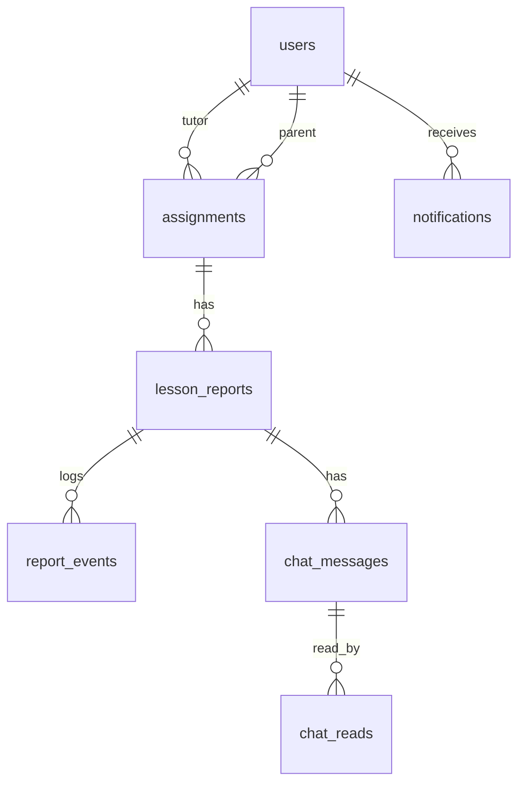

# Data Model

```mermaid
erDiagram
  users ||--o{ assignments : tutor
  users ||--o{ assignments : parent
  assignments ||--o{ lesson_reports : has
  lesson_reports ||--o{ report_events : logs
  lesson_reports ||--o{ chat_messages : has
  chat_messages ||--o{ chat_reads : read_by
  users ||--o{ notifications : receives
```

主要テーブルは `users`, `assignments`, `lesson_reports`, `report_events`, `chat_messages`, `chat_reads`, `notifications` です。Enum は Python 側で定義し、DB には varchar として保存します。

